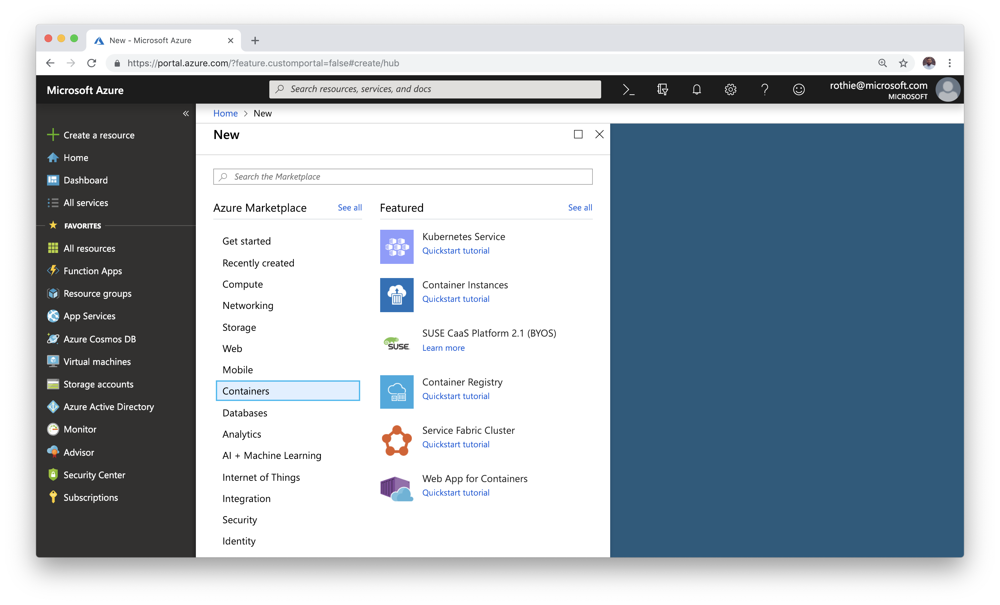
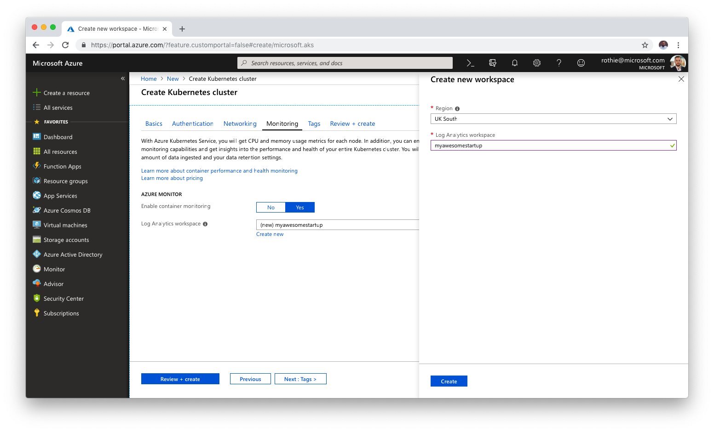
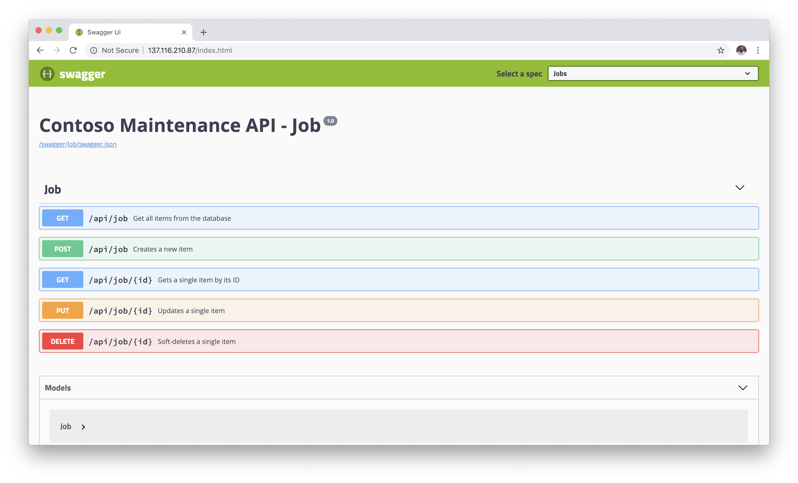

# Azure Kubernetes Service

The [Azure Kubernetes Service](https://azure.microsoft.com/en-us/services/kubernetes-service/) (AKS) is a fully managed Kubernetes container orchestration service in the cloud, which takes infrastructure management load off of you and lets you focus on managing the Kubernetes cluster itself.

In Kubernetes, the **Master Nodes** need to be highly available, as the cluster cannot operate without them. While you can easily loose **Worker nodes**, which will be replaced by Kubernetes automatically, the Master Nodes are mission critical. AKS manages those Master Nodes for you in a fully automated manor. This gives you the flexibility to fully focus on the applications that you want to deploy to your cluster.

All you need to do is tell Microsoft Azure how powerful your worker nodes shall be and how many of them you need. For scaling, you can change those values at runtime later. The rest is pure Kubernetes.

> **Important:** Kubernetes is all about Containers. To deploy the application's services to a Kubernetes cluster, make sure you read the [Work with containers](../) article before.

## 1. Create a Kubernetes Cluster

Creating an AKS cluster in Azure is easy. Simply click the ***Create a resource*** button at the top-left corner of the [Azure Portal](https://portal.azure.com), select the ***Containers** section and click on ***Kubernetes Service***. A dialog appears and guides you through the creation of your AKS cluster.



#### Basic

First, we need to enter some basic information about our cluster, such as Subscription and Resource Group but also the Kubernetes Version we want to use and how powerful our cluster needs to be.


Enter the following values and proceed to the *Authentication* step.

- **Resource group:** *choose the one you created earlier*
- **Kubernetes cluster name:** `myawesomestartupaks` (or similar)
- **Region:** *same as your other services*
- **Kubernetes version:** at least 1.11.14
- **DNS prefix name:** `myawesomestartup` (or similar)
- **Node size:** Standard DS2 v2
- **Node count:** 3

The **Node size** and **Node count** values determine the performance of your cluster. Kubernetes distributes the deployed services and incoming load across those nodes. The more you have, the more failure secure and high performant you are.

#### Authentication

In Kubernetes, authentication plays an important role. You might want to enable **RBAC (Role Base Access Control)**, to define, which team members and Kubernetes services are allowed to do what. For auto-scaling, the AKS cluster also needs a **service principal**. This is a virtual user in the Active Directory and defines, what a non-human service is allowed to do. We would want AKS to allow to spin up additional VMs as Worker Nodes, when needed.


Enter the following values and proceed to the *Monitoring* step.

- **Service principal:** *leave new service principal*
- **Enable RBAC:** No

> **Hint:** For the demo purpose of this workshop, you can leave **RBAC** off. In a real-world scenario, you would probably want to turn it on and follow the [Principle of least privilege](https://en.wikipedia.org/wiki/Principle_of_least_privilege) for enhanced security!

#### Monitoring

Being able to monitor you cluster at runtime can become mission critical, when facing issues are wanting to measure performance. So we should turn monitoring on an create a new **Log Analytics** workspace.



Enter the following values and proceed to the *Review + create* step.

- **Enable container monitoring:** Yes
- **Log Analytics workspace:** *create a new one in your region*

#### Review + create

In the last step, the Azure Portal checks, if all your settings make sense and if a cluster can be created in the way you described it. Once the validation is completed successfully, you can hit the ***Create*** button and let Azure do its job.

Creating an AKS cluster can take some minutes, as a bunch of VMs are provisioned and connected with each other in the background. This is why you will see a **Deployment Overview** for some time, to track the progress and success of your deployment.


## 2. Discover the service

After some minutes, you AKS has been created successfully and you should be able to open you cluster overview in the Azure Portal. As Kubernetes itself works mostly command line based or through its own [Web UI (the Kubernetes dashboard)](https://kubernetes.io/docs/tasks/access-application-cluster/web-ui-dashboard/), there is not too much to see here. What users can manage from this portal is mostly related to the underlying hardware or the Kubernetes installation itself.


#### Overview

In the **Overview** section, you will find the most important information about your custer such as Location, Kubernetes version and the address of your API server. You will also find information about how many cores and GBs of memory power the applications in your cluster.

If you click on the ***View Kubernetes dashboard*** button, you will find instructions on how to connect your local development environment with the Kubernetes cluster in the cloud.

#### Upgrade

Here you can set the Kubernetes version, that you want to have installed on your Worker Nodes. An upgrade will roll out safely in stages so your container applications can continue to run smoothly while the upgrade is taking place.

#### Scale

If your cluster needs more power, that's the place to go. Here you can add or remove Worker Node VMs from your cluster. If you don't want to do this manually, you should take a look at the [Cluster Auto Scaler](https://docs.microsoft.com/en-us/azure/aks/autoscaler) capabilities of AKS.

## 3. Deploy the applications

As mentioned, working with Kubernetes is mostly done via the command line. So you need the [`kubectl` tool](https://kubernetes.io/docs/tasks/tools/install-kubectl/) installed on your machine. Once you did this, you can connect your local environment with the AKS cluster.

### 3.1 Connect to the AKS cluster

To configure `kubectl` to connect to your Kubernetes cluster, use the [`az aks get-credentials`](https://docs.microsoft.com/en-us/cli/azure/aks?view=azure-cli-latest#az-aks-get-credentials) command. This command downloads credentials and configures the Kubernetes CLI to use them.

```bash
az aks get-credentials --resource-group MyAwesomeNewStartup --name myawesomenewstartupaks
```

To verify the connection to your cluster, use the following commands to get some cluster information and a list of the cluster nodes.

```bash
kubectl cluster-info

kubectl get nodes
```

### 3.2 Run the applications

In Kubernetes, you work with manifest files. A Kubernetes manifest file defines a desired state for the cluster, such as what container images to run. In this workshop, a manifest is used to create all objects needed to run the samples. This manifest includes multiple [Kubernetes deployments](https://docs.microsoft.com/en-us/azure/aks/concepts-clusters-workloads#deployments-and-yaml-manifests). One for the Web API, one for the Chat Bot and so on. In addition, some [Kubernetes services](https://docs.microsoft.com/en-us/azure/aks/concepts-network#services) are created.

Depending on your setup and if you want to use your own Container Registry or DockerHub, you can choose between the different `kubernetes*.yml` files in this workshop repository.

Pick the one for your needs and deploy the application using the [`kubectl apply`](https://kubernetes.io/docs/reference/generated/kubectl/kubectl-commands#apply) command and specify the path and name of your manifest

```bash
kubectl apply -f kubernetes.yml
```

### 3.3 Test the application

When the application runs, a Kubernetes service exposes the application front end to the internet. This process can take a few minutes to complete. To monitor progress, use the [`kubectl get service`](https://kubernetes.io/docs/reference/generated/kubectl/kubectl-commands#get) command with the `--watch` argument.

```bash
kubectl get service contosomaintenance-api --watch
```

Initially the **external IP address** for the `contosomaintenance-api` service is shown as pending. When it changes from prending to an actual public IP address, you can stop the watch process with `CTRL + C`. The output should look similar to this:

```bash
NAME                     TYPE           CLUSTER-IP   EXTERNAL-IP      PORT(S)
contosomaintenance-api   LoadBalancer   10.0.76.33   137.116.210.87   80:31930/TCP
```

In this case, you could reach your service at `137.116.210.87`. Open the browser at this address to take a look at the running Web API.



## Use Secrets

Throughout the workshop we will create more and more services and need to connect them with each other. This will be mostly done by placing the services connection information (e.g. Connection Strings) in a securely stored but for the service accessible place. The demo application from this workshop depends on them to connect with the database, blob storage and so on.

For Kubernetes, those places are called [Kubernetes Secrets](https://kubernetes.io/docs/concepts/configuration/secret). The deployment manifests are configured in a way that they will pull connection details from a secret called `appsettings`. To create one this, use the `kubectl create secret` command.

```bash
kubectl create secret generic appsettings \
    --from-literal=CosmosDb__Endpoint=<YOUR_COSMOSDB_ENDPOINT> \
    --from-literal=CosmosDb__Key=<YOUR_COSMOSDB_KEY> \
    --from-literal=AzureStorage__StorageAccountName=<YOUR_STORAGEACCOUNT_NAME> \
    --from-literal=AzureStorage__Key=<YOUR_STORAGEACCOUNT_KEY> \
    --from-literal=ApplicationInsights__InstrumentationKey=<YOUR_APPINSIGHTS_KEY>
```

If you want to update the secrets, you will need to delete them first.

```bash
kubectl delete secret appsettings
```

Then you can create the secrets again. By design, [Kubernetes won't push Secret updates to running Pods](https://kubernetes.io/docs/concepts/configuration/secret/#secret-and-pod-lifetime-interaction). So make sure to re-deploy your application using the `kubectl apply` command again.

```bash
kubectl apply -f kubernetes.yml
```

As we will deploy more Azure services throughout the workshop, that we need to connect with each other, you will come back to this section quite often.

&nbsp;

---
### [Next Step: Data Storage](../../04%20Data%20Storage/README.md)
---

&nbsp;
