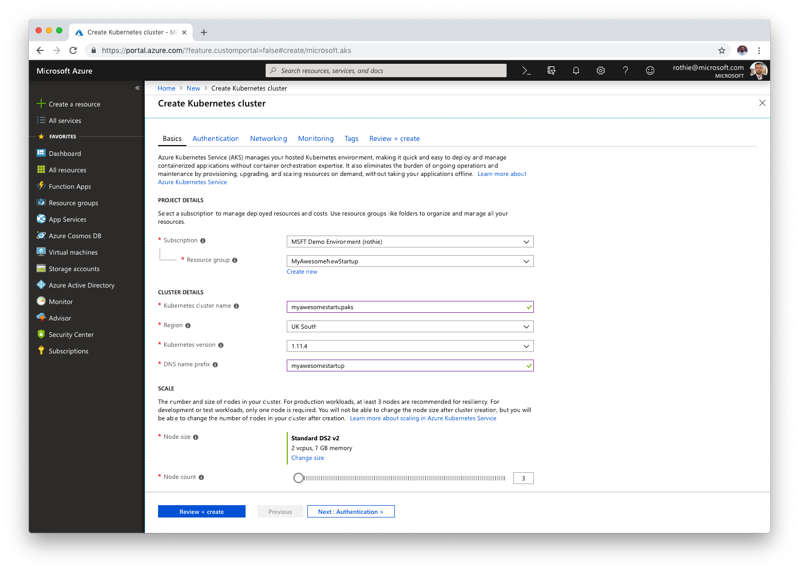
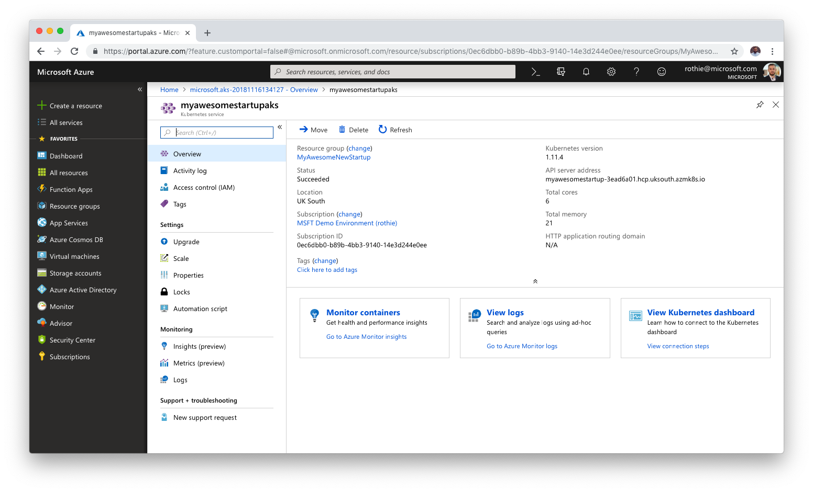

# Azure Kubernetes Service

The [Azure Kubernetes Service](https://azure.microsoft.com/en-us/services/kubernetes-service/) (AKS) is a fully managed Kubernetes container orchestration service in the cloud, which takes infrastructure management load off of you and lets you focus on managing the Kubernetes cluster itself.

In Kubernetes, the **Master Nodes** need to be highly available, as the cluster cannot operate without them. While you can easily loose **Worker nodes**, which will be replaced by Kubernetes automatically, the Master Nodes are mission critical. AKS manages those Master Nodes for you in a fully automated manor. This gives you the flexibility to fully focus on the applications that you want to deploy to your cluster.

All you need to do is tell Microsoft Azure how powerful your worker nodes shall be and how many of them you need. For scaling, you can change those values at runtime later. The rest is pure Kubernetes.

> **Important:** Kubernetes is all about Containers. To deploy the application's services to a Kubernetes cluster, make sure you read the [Work with containers](../) article before.

## Create a Kubernetes Cluster

Creating an AKS cluster in Azure is easy. Simply click the ***Create a resource*** button at the top-left corner of the [Azure Portal](https://portal.azure.com), select the ***Containers** section and click on ***Kubernetes Service***. A dialog appears and guides you through the creation of your AKS cluster.


### Basic

First, we need to enter some basic information about our cluster, such as Subscription and Resource Group but also the Kubernetes Version we want to use and how powerful our cluster needs to be.



Enter the following values and proceed to the *Authentication* step.

- **Resource group:** *choose the one you created earlier*
- **Kubernetes cluster name:** `myawesomestartupaks` (or similar)
- **Region:** *same as your other services*
- **Kubernetes version:** at least 1.11.14
- **DNS prefix name:** `myawesomestartup` (or similar)
- **Node size:** Standard DS2 v2
- **Node count:** 3

The **Node size** and **Node count** values determine the performance of your cluster. Kubernetes distributes the deployed services and incoming load across those nodes. The more you have, the more failure secure and high performant you are.

### Authentication

In Kubernetes, authentication plays an important role. You might want to enable **RBAC (Role Base Access Control)**, to define, which team members and Kubernetes services are allowed to do what. For auto-scaling, the AKS cluster also needs a **service principal**. This is a virtual user in the Active Directory and defines, what a non-human service is allowed to do. We would want AKS to allow to spin up additional VMs as Worker Nodes, when needed.


Enter the following values and proceed to the *Monitoring* step.

- **Service principal:** *leave new service principal*
- **Enable RBAC:** No

> **Hint:** For the demo purpose of this workshop, you can leave **RBAC** off. In a real-world scenario, you would probably want to turn it on and follow the [Principle of least privilege](https://en.wikipedia.org/wiki/Principle_of_least_privilege) for enhanced security!

### Monitoring

Being able to monitor you cluster at runtime can become mission critical, when facing issues are wanting to measure performance. So we should turn monitoring on an create a new **Log Analytics** workspace.


Enter the following values and proceed to the *Review + create* step.

- **Enable container monitoring:** Yes
- **Log Analytics workspace:** *create a new one in your region*

### Review + create

In the last step, the Azure Portal checks, if all your settings make sense and if a cluster can be created in the way you described it. Once the validation is completed successfully, you can hit the ***Create*** button and let Azure do its job.

Creating an AKS cluster can take some minutes, as a bunch of VMs are provisioned and connected with each other in the background. This is why you will see a **Deployment Overview** for some time, to track the progress and success of your deployment.


## Discover the service

After some minutes, you AKS has been created successfully and you should be able to open you cluster overview in the Azure Portal. 



## Add Secrets

https://kubernetes.io/docs/concepts/configuration/secret/

```bash
kubectl create secret generic appsettings \
        --from-literal=CosmosDb__Endpoint=CosmosDb_Endpoint \
        --from-literal=CosmosDb__Key=CosmosDb_Key \
        --from-literal=AzureStorage__StorageAccountName=Storage_AccountName \
        --from-literal=AzureStorage__Key=Storage_AccountKey \
        --from-literal=ApplicationInsights__InstrumentationKey=ApplicationInsights_Key
```

## Deploy the Applications

```bash
kubectl create -f kubernetes.yml
```

## Additional Topics

- Static IP Address for services
