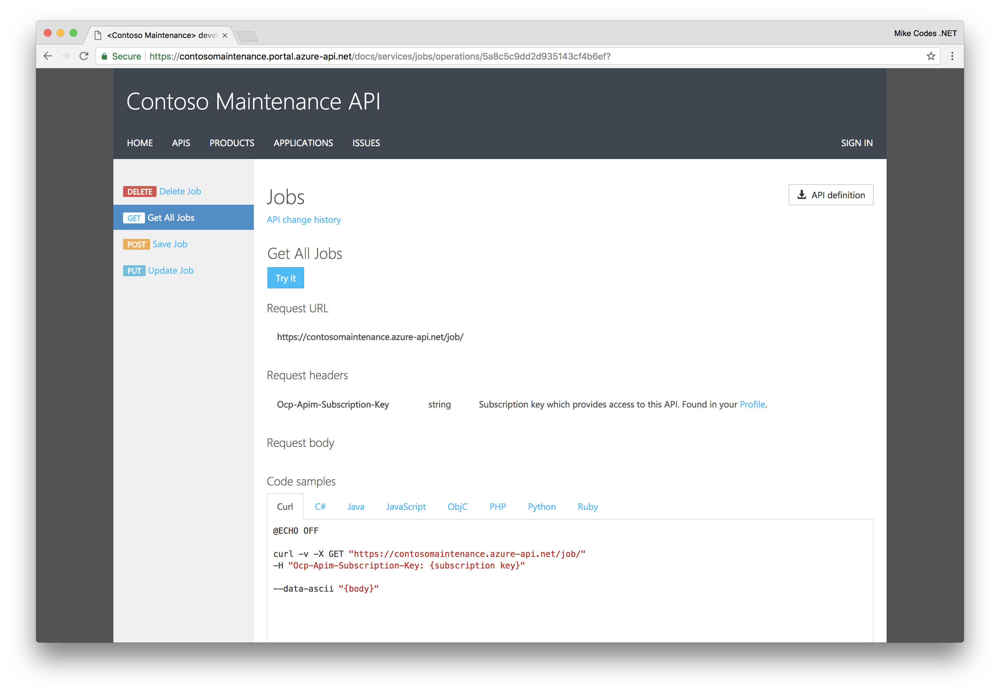
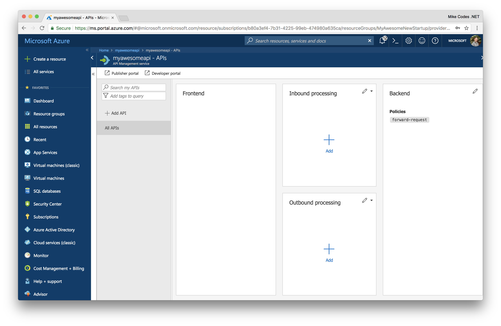
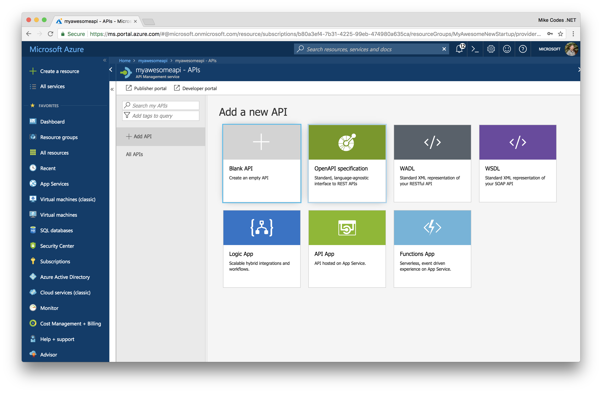
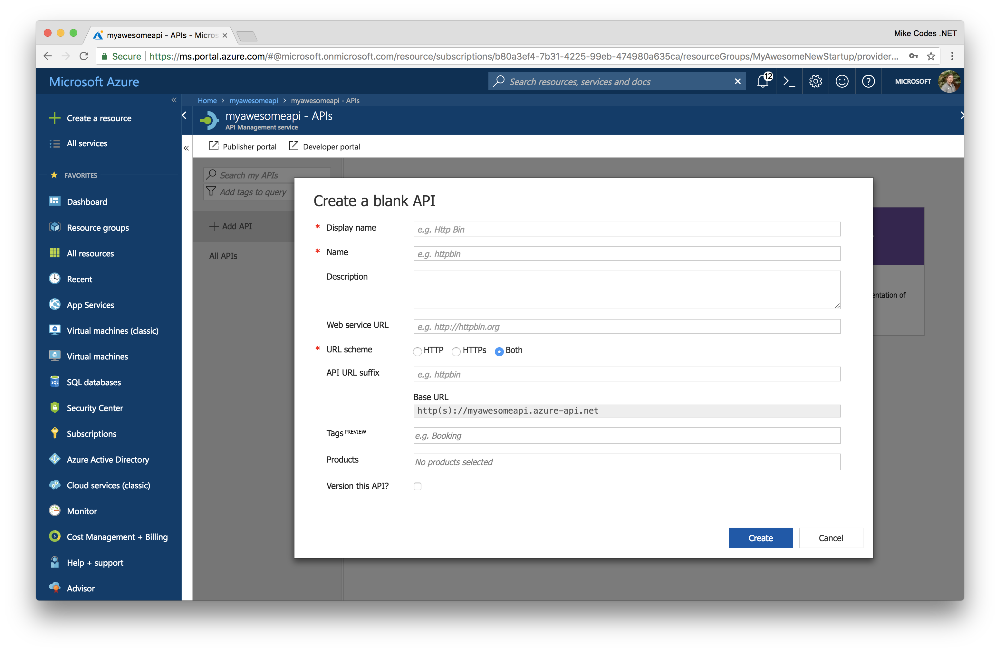
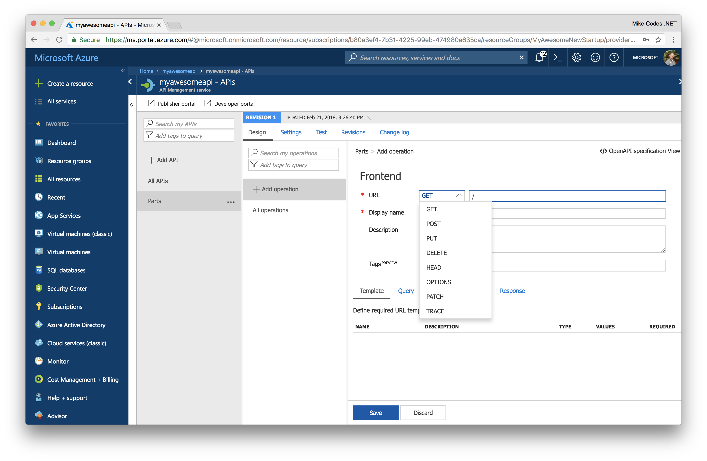
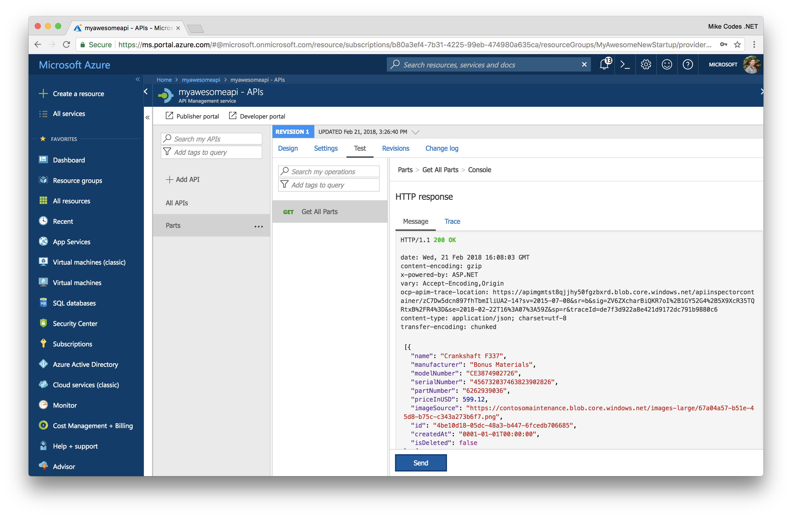
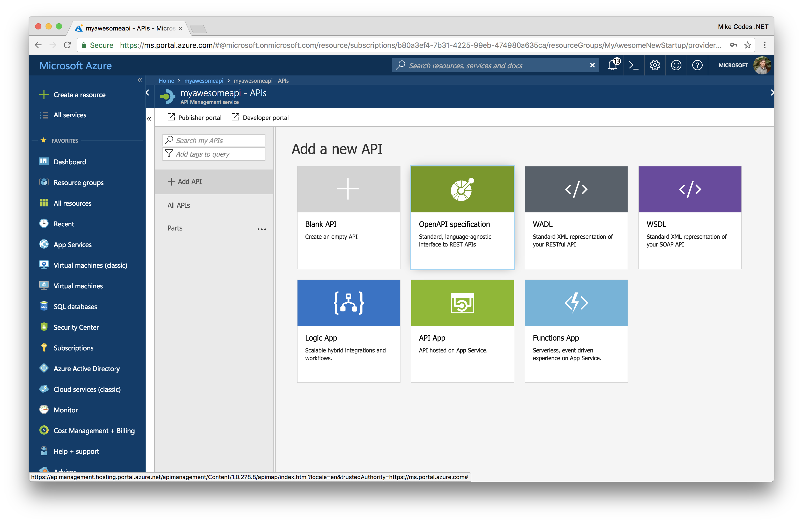
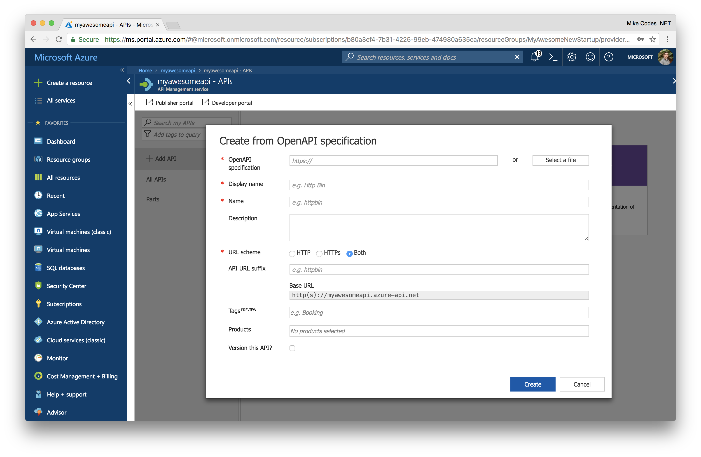
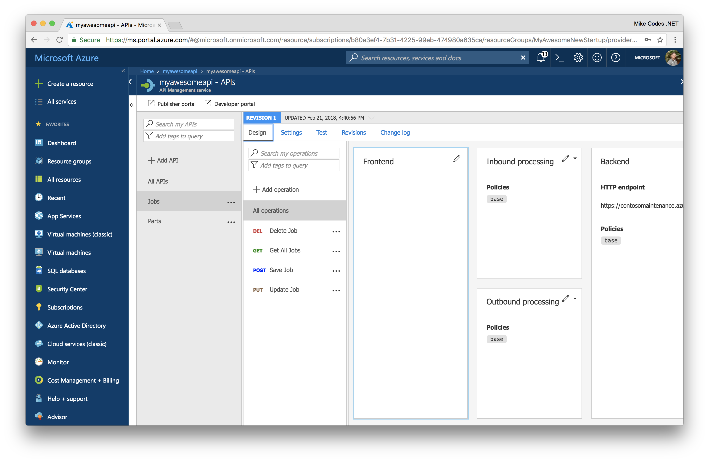
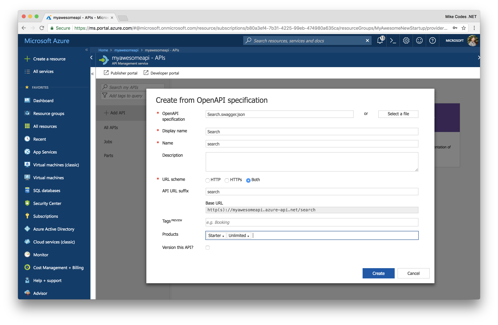

# API Management

Azure API Management is a turnkey solution for publishing APIs for external and internal consumption. It allows for the quick creation of consistent and modern API gateways for existing or new backend services hosted anywhere, enabling security and protection of the APIs from abuse and overuse. We like to think of API Management as businesses digital transformation hub as it empowers organisations to scale developer onboarding as well as monitoring the health of services. 

#### Why API Management

We'll be using API Management in today's workshop to act as both a gateway our Azure Resources and as a source of documentation about what features we've made available to consumers of our services. 

- Package and publish APIs to developers and partners
- Onboard developers via self-service portal
- Ramp-up developers with documentation, samples and API console
- Manage and control API access and protect them from abuse
- Monetize APIs or parts of it
- Bundle multiple APIs together
- Add new capabilities to existing APIs, such as response caching
- Insights of usage and health from analytics reports

#### What does it cost

[Azure API Management Pricing](https://azure.microsoft.com/en-us/pricing/details/api-management/)

You can find a our API Management portal running [here](https://contosomaintenance.portal.azure-api.net/)

### Exploring APIs
You can explore APIs with API Management and even get automatically generated snippets in a variety of languages which demonstrate whats required to interact with the Azure services.

## 1. Deploying API Management 

Let's head over to our Resource Group again and hit the ***Add*** button again.

Select the ***API Management*** result. You'll then navigate to the Creation blade.

Choose the following settings and hit the Create button to start provisioning the API Management instance.

- **Name:** myawesomeneapi
- **Resouce Group:** Use existing
- **Location:** Same as your Web App
- **Organization Name:** The name of your business (it'll appear in the portals).
- **Administrator Email:** Set this to yourself
- **Pricing Tier:** You can select *Developer* for this workshop.

API Management can take about 20 minutes to deploy so now might be a good time to take a quick break if you need it. If you wish to monitor the deployment progress, you can click on the right bell icon. 

It's worth checking that the service is active after deployment as this can take a couple more minutes.

## 2. Understanding our usage

We're using API Management as our access layer, routing all HTTP requests to our backend through it. You can see this below in this basic diagram (it's not the entire architecture, but more of a high-level overview).

If we imagine the flow for searching jobs. Our request leaves the phone, hits our API Management, which will route it to the nearest instance of our backend. The backend that takes the request and routes it to the correct controller, which has the implementation for interacting with Azure Search.

## 3. Configuring API Management

Once API has finished its deployment process, we can start to configure it for interacting with the App Service instance we deployed earlier.

### 3.1 Implementing Operations

We need to define our operations for the API Management. We have already deployed our backend so we should be in a position to hook up to the App Service instance and consume real data. It's worth keeping in mind that its possible to send Mock responses back from API Management, which can help in the development of large solutions.

To kick off, we'll create the Parts API manually, and then for the rest of the APIs, we'll use pre-built OpenAPI Specifications to automagically configure API Management. I've deleted the default Echo API from the API list as we won't be needing this. It's entirely up to you if you want to do this as well (it wont affect your project).

#### 3.1.1 Parts

Parts is one of the easiest APIs to implement within the project as we'll only be requesting an array of parts from our backend. We don't-have any variables within our queries or other elements that could complicate the request.

Click on the ***Add API*** Button and select ***Blank API***.

We can then provide a few details about our API.

- **Display Name:** This name is displayed in the Developer portal.
- **Name:** Provides a unique name for the API.
- **Description:** Description of the API
- **Web Service URL:** The URL where we'll be sending these requests.
- **URL Scheme** Determines which protocols can be used to access the API.
- **API URL Suffix:** The suffix is appended to the base URL for the API management service. API Management distinguishes APIs by their suffix, and therefore the suffix must be unique for every API for a given publisher.
- **Tags:** Tags enable the organization of large lists – both regarding management and presentation on the developer portal.
- **Products:** Publish the API by associating the API with a product. To optionally add this new API to a product, type the product name. This step can be repeated multiple times to add the API to multiple products.
- **Version This API:** Would you like to version the API?

Once we click ***Create***, we'll be able to add our single REST operation.

We can then click on ***Add Operation***.

By default, operations will be set configured for GET Requests, but we can change this using the drop-down menu.

- **HTTP Verb:** You can choose from one of the predefined HTTP verbs.
- **URL:** A URL path for the API.
- **Display Name:**
- **Description:** Describe the operation that is used to provide documentation to the developers using this API in the Developer portal.
- **Tags:** Tags enable the organisation of large lists – both regarding management and presentation on the developer portal.

You can see all the HTTP Verbs we can use within API Management Operations.

We can go ahead and click ***Save***, and API Management is ready for testing.

#### 3.1.2 Jobs

To save time, we will use the API specifications generated by Swagger which allow API Management to automatically configure your APIs and operations. You can find these at the /swagger endpoint of your Web App. In our case, that's http://myawesomestartupapi.azurewebsites.net/swagger.

We're now ready to create a new API from the Jobs spec found in the Swagger folder. To do this, click on the ***OpenAPI Specification*** options.

Paste the url for the API specification in the url field.

This will fill in most of the information for you, but you should make sure to add the following:

- **API Url Suffix:** `job` (this must be lowercase and do not pluralise it) 
- **Products:** Starter & Unlimited.

You're now ready to click ***Create***. The API Spec contains all the operations we'll need for interacting with the Jobs Controller in the ASP.NET Project.

#### 3.1.3 Search

We can now repeat the same process for Search, but this time we'll want to make sure we set the **API Url Suffix:** to `search`.

#### 3.1.4 Photos

> **Warning:** We're currently experiencing an issue with our implementation of Photo upload. Please bear with us while we resolve this. 

&nbsp;

---
### [Next Step: Data Storage](../11%20Authentication)
---

&nbsp;
